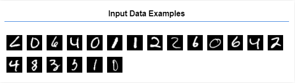
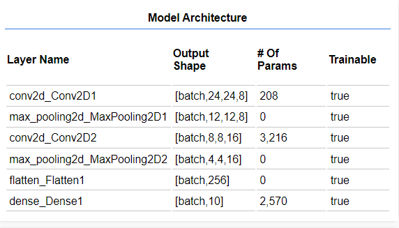
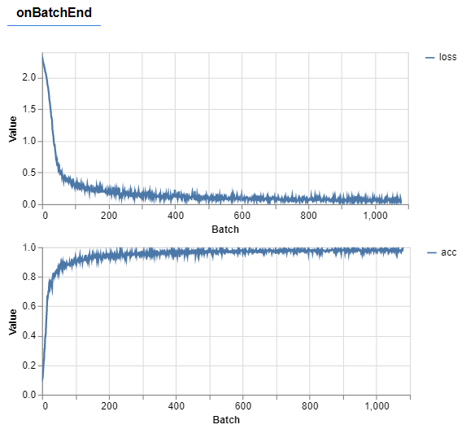
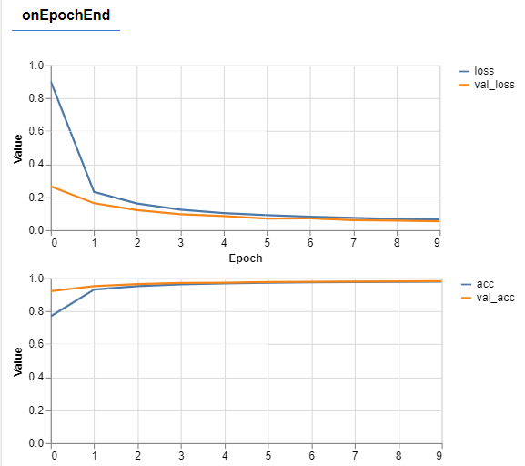
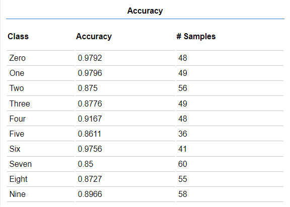

# tfjs-MNIST-demo


## Use CDN 
```javascript
<!-- Import TensorFlow.js -->
<script src="https://cdn.jsdelivr.net/npm/@tensorflow/tfjs@3.8.0/dist/tf.min.js"></script>

<!-- Import tfjs-vis -->
<script src="https://cdn.jsdelivr.net/npm/@tensorflow/tfjs-vis@1.0.2/dist/tfjs-vis.umd.min.js"></script>
```

## Load Data
Each image is 28px wide 28px high and has a 1 color channel as it is a grayscale image. So the shape of each image is [28, 28, 1].




## Train Model


### There are 55,000 training materials and 10,000 verification materials.
### When batch=1079, the accuracy very close to 1, and the loss=0.0136.


### loss and val_loss are getting lower,finally loss=0.0644 and val_loss=0.0542.
### acc and val_acc  are getting higher,in the end both are very close to 1.
### Obviously,the model is good.


## Make Predictions
Take 500 images and predict what digit is in them.

The argmax function provides the index of the highest probability category. 

The model outputs the probability of each category. Here, find the highest probability and use it as a prediction

## Confusion Matrix


## Evaluation
### The average recognition accuracy rate is over __90%__


## Demo

### Create a web canvas to detect drawing numbers.
[__Just Try It__](https://Hsu-hui.github.io/tfjs-MNIST-demo/index.html)


## Source

[Tensorflow Official Tutorials](https://www.tensorflow.org/js/tutorials/training/handwritten_digit_cnn)

[Tensorflow.js MNIST Example Github](https://github.com/tensorflow/tfjs-examples/tree/master/mnist)